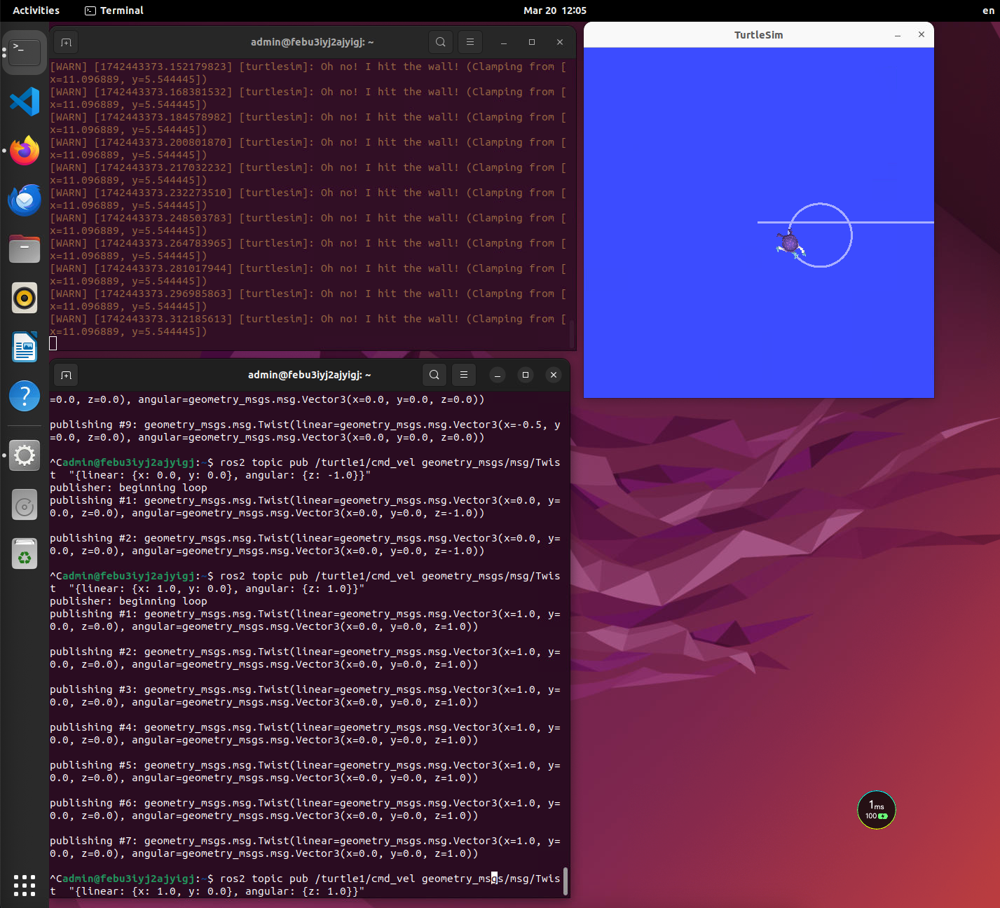
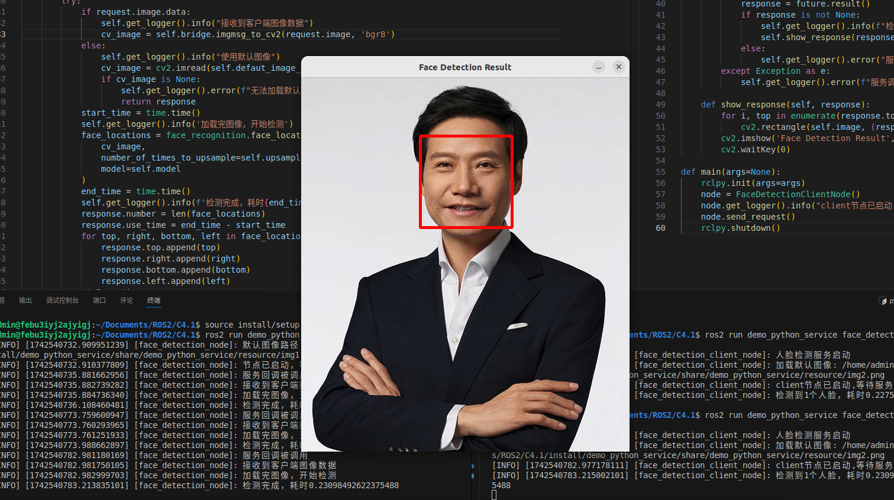
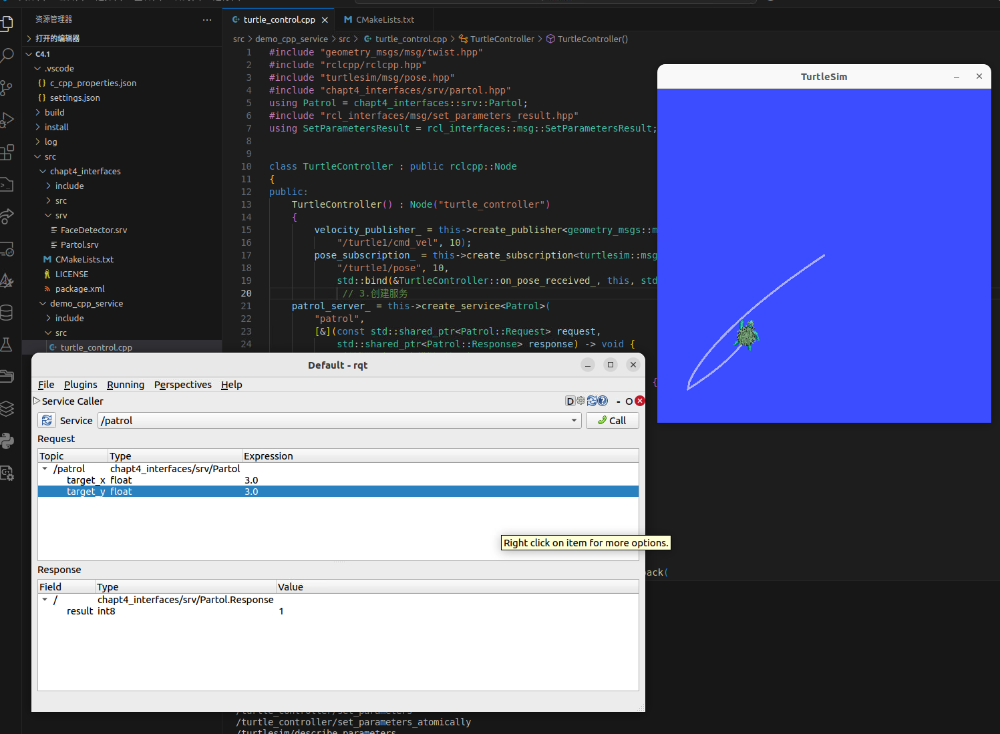

# Learning-ROS2 学习笔记  

## 一、学习历程  

### 3 月 17 日  

#### 系统环境搭建  
- 下载并安装 Linux 系统虚拟机。  
- 将虚拟机系统升级至 **Ubuntu Linux - Jammy Jellyfish (22.04)**。  
  - 在升级过程中，掌握了切换镜像下载源的方法。  
  - 通过更换镜像源，软件包下载速度大幅提升，稳定性增强，为后续学习和开发工作筑牢根基。  
  - 了解不同的ROS2的版本号，最终选择ROS 2 Humble Hawksbill，因为有较好兼容性。

#### 发现一键安装工具  
- 了解到 [**小鱼的一键安装系列**](https://fishros.org.cn/forum/topic/20/%E5%B0%8F%E9%B1%BC%E7%9A%84%E4%B8%80%E9%94%AE%E5%AE%89%E8%A3%85%E7%B3%BB%E5%88%97?lang=en-GB) 中的 ROS2 部分。  
 
- 该工具极大简化了 ROS2 安装流程，成功规避了繁琐的手动安装步骤，节省大量时间与精力，在此对其便捷性表示诚挚感谢。  

---

### 3 月 18 日  

#### 基础节点搭建  
- 创建名为 **C2_1** 的目录。  
- 在此目录中，完成 Python 节点和 C++ 节点的基础搭建工作。  
  - 学习节点相关知识：  
    - 节点基本概念、作用  
    - 在 ROS2 系统中的运行机制  
    - 节点运行所需的对应库  

#### 功能包创建学习  
- 创建目录 **C2_2**，开启对功能包创建的学习。  

##### Python 功能包创建  
使用以下指令创建 Python 功能包：  
```bash
ros2 pkg create --build-type ament_python <package_name> --dependencies <dependency1> <dependency2> ...
```
示例：  
```bash
ros2 pkg create --build-type ament_python my_python_pkg --dependencies rclpy std_msgs
```
- 成功创建名为 `my_python_pkg` 的 Python 功能包，依赖于 `rclpy` 和 `std_msgs` 库。  

##### C++ 功能包创建  
使用以下指令创建 C++ 功能包：  
```bash
ros2 pkg create --build-type ament_cmake <package_name> --dependencies <dependency1> <dependency2> ... --node-name <node_name>
```
示例：  
```bash
ros2 pkg create --build-type ament_cmake my_cpp_pkg --dependencies rclcpp std_msgs --node-name my_cpp_node
```
- 成功创建名为 `my_cpp_pkg` 的 C++ 功能包，并生成名为 `my_cpp_node` 的节点。  

##### 功能包构建  
使用以下指令对功能包进行构建：  
```bash
colcon build
```
- 将代码编译成可执行文件，使功能包能够在 ROS2 环境中正常运行。  

---

### 3月19日

1. **多线程与封装复习**
    - 系统性复习Python和C++的多线程与封装知识。运用多线程技术下载小说，切实提升对多线程并发执行原理及实践应用的理解。通过多线程下载任务，体会到多线程在提升I/O密集型任务效率方面的显著优势，例如加快了小说资源从网络获取的速度。
    - 在C++复习过程中，深入接触`<functional>`头文件。该头文件提供了一系列与函数对象相关的工具，如`std::function`可用于封装各种可调用对象（函数指针、lambda表达式、函数对象等），实现统一的调用接口；`std::bind`能够绑定函数参数，生成新的可调用对象。目前对`<functional>`头文件内诸多功能，如模板类和函数模板的使用细节掌握不够扎实，后续计划结合具体代码案例，如实现一个通用的回调函数机制或函数对象适配器，深入学习以增强运用能力。
2. **学习计划展望**
    - 后续针对`<functional>`头文件，安排专项学习时间。详细阅读官方文档，深入理解每个类和函数模板的功能、参数及返回值。同时参考知名开源项目中对`<functional>`的使用案例，分析其设计思路和应用场景。
    - 进一步拓展多线程与封装在ROS2开发中的应用。探索如何在ROS2节点中合理运用多线程优化数据处理流程，例如在数据订阅与发布的过程中，利用多线程避免阻塞主线程，提高节点响应速度。对于封装，思考如何将常用的ROS2功能模块进行封装，提高代码复用性和可维护性，如将节点初始化、参数配置等操作封装成独立的函数或类。

---

### 3月20日 Learning-ROS2 学习笔记  

1. **Publisher和Subscriber的学习与实践**
    - 深入学习了Python和C++中Publisher和Subscriber的使用方法。在3.1的文档实践中，利用Python节点实现了小说的上传和下载功能，并且借助`speaker = espeakng.Speaker()`和`speaker.voice = 'zh'`实现了对下载小说内容的语音朗读。这一过程不仅加深了对ROS2中数据传输机制的理解，还拓展了Python在实际应用中的功能，体会到语音功能为项目带来的趣味性和实用性。
    - 使用C++完成了海龟画图的主要任务，包括接收和发布相关消息。通过这一实践，熟悉了C++在ROS2环境下的消息通信流程，进一步掌握了Publisher和Subscriber的具体操作，对C++处理ROS2消息的能力有了更直观的认识。
        


2. **ROS小项目学习**
    - 在3.4的文档学习中，参与了一个ROS小项目。学习了使用C++创建自定义通信，即创建msg文件来定义消息结构。这是实现自定义数据传输的重要基础，理解了消息定义在ROS2通信中的关键作用。
    - 项目中使用Python作为Publisher，C++作为display（显示部分）。通过这种跨语言的组合，体会到不同语言在ROS2项目中的优势互补。Python的简洁性和丰富的库资源便于快速实现数据的发布功能，而C++的高效性和对底层的控制能力适合处理显示相关的任务。

3. **学习难点与计划**
    - 学习过程中发现对C++代码类的知识掌握不够扎实，容易混淆不同类的功能和使用方法。这可能影响到后续对复杂C++项目的理解和开发。
    - 针对C++代码类知识的薄弱环节，计划在接下来的学习中，系统地复习C++类的相关知识，包括类的定义、继承、多态等特性。通过阅读相关书籍、在线教程以及分析优秀的C++代码示例，加深对类的理解和运用能力。同时，结合ROS2项目实践，将类的知识应用到实际开发中，通过实践巩固所学知识，对于昨天c++多线程已经复习完毕，今天复习一下c++的lambda函数和接收函数。

---

### 3月21日 ROS2学习记录

## 一、学习内容概述
在3月21日的学习中，深入探究了ROS2的服务通信机制，并结合Python和C++进行了实际应用开发。同时，学习了rqt工具的使用、参数声明更改以及launch文件启动多节点的方法。

## 二、具体学习内容
1. **服务通信学习**
    - **自定义服务通信参数与接口**：全面了解了服务通信中自定义参数和接口的方法，明确了服务通信在请求-响应式交互场景中的关键作用，它适用于获取特定信息或执行特定任务并期望得到结果的情形。
    - **Python实现人脸识别服务与客户端**：借助Python成功创建了人脸识别的服务和客户端。通过精心定义服务的请求和响应结构，顺利实现了人脸识别相关数据的交互。
    
    深刻体会到Python在快速搭建服务和客户端方面的显著便捷性，能够高效地处理数据交互逻辑。
    - **C++实现海龟控制的客户端与服务端**：运用C++完成了对海龟的控制功能，涉及客户端和服务端的代码编写。通过编写C++代码，实现了与海龟仿真节点的顺畅交互，既能发送控制指令，又能接收状态反馈。
    的示例，切实掌握了C++在ROS 2服务通信中的具体实现方式，充分感受到C++在处理底层控制逻辑时的高效性能，能够精准地实现对海龟的控制操作。
2. **rqt工具及参数学习**
    - **rqt工具使用**：系统学习了rqt工具的使用方法，它是一款功能强大的可视化调试工具。熟练掌握了如何利用rqt来全面监控和调试ROS 2系统中的各类组件和数据，例如实时查看话题消息的内容和流向、准确了解服务的状态等，为系统的调试和优化提供了有力支持。
    - **参数声明与更改**：深入掌握了使用参数声明来灵活更改节点运行时参数的技巧。充分理解了参数在ROS 2中的重要意义，通过参数的动态配置，无需修改代码即可改变节点的行为，大大提高了系统的灵活性和可配置性，使系统能够更好地适应不同的应用场景和需求。
3. **launch文件学习**
    - **多节点启动方法**：认真学习了使用launch文件启动多节点的方法。清晰认识到launch文件在管理和启动多个相关节点方面的便利性，它不仅可以设置节点的启动顺序，确保各个节点按照预定的逻辑启动，还能实现参数的传递，为节点的初始化提供必要的配置信息。通过实际操作，成功学会了编写简单的launch文件来启动多个ROS 2节点，为后续开展更复杂的项目开发奠定了坚实的基础，能够提高项目的部署效率和运行稳定性。

## 三、学习总结与展望
通过3月21日的学习，对ROS2的服务通信机制有了更深入的理解，并且在Python和C++的实践应用中积累了宝贵的经验。同时，掌握了rqt工具、参数声明和launch文件的使用方法，这些知识和技能将对后续的ROS2学习和项目开发起到重要的推动作用。在未来的学习中，计划进一步深入学习ROS2的其他通信机制和高级功能，不断提升自己在机器人操作系统领域的能力和水平。 


---

### 3月22日 ROS2学习记录
1. **TF 原理探究与实践**
- **Python 实现手眼坐标变换**: 深入学习 TF（坐标变换）原理，理解其在机器人领域描述不同坐标系关系的关键作用。使用 Python 编写代码，成功完成手眼坐标更换操作。在此过程中，掌握通过 TF 树管理和查询坐标系变换关系，熟练运用tf2_ros库中的Buffer和TransformListener等类与函数获取和处理坐标变换数据，加深对 TF 原理的理解。
- **Python 查询 TF 位置**:
利用 Python 节点，学会查询 TF 树中特定坐标系位置信息。编写代码可精确获取目标坐标系相对其他坐标系的平移和旋转信息，此技能对机器人定位和导航操作意义重大，同时学会依据坐标变换信息调整机器人运动控制指令。
- **C++ 实现扫地机器人位置更新与 TF 查询**:
采用 C++ 语言，结合扫地机器人实际场景，学习将机器人位置信息更新到 TF 树，并查询相关坐标变换。编写 C++ 代码实现与扫地机器人状态信息交互，将位置和姿态数据发布到 TF 树，同时获取其他相关坐标系信息用于路径规划和避障。过程中熟悉 C++ 中tf2_ros库使用方法及与 ROS2 节点的集成。

2. **可视化工具学习**
- **rqt 工具的深入学习**
进一步探索 rqt 工具，在已掌握监控话题消息和服务状态功能基础上，学会使用 rqt 插件进行复杂数据分析和可视化。例如，运用 rqt_plot 插件实时绘制传感器数据曲线，通过观察数据变化趋势分析系统性能和行为，助力 ROS2 系统调试与优化。
- **Rviz 工具的初步使用**
开始学习 Rviz 工具，这是机器人领域强大的三维可视化工具，用于展示机器人模型、传感器数据和路径规划等。了解 Rviz 基本界面和操作方法，学会添加和配置机器人模型插件、激光雷达数据插件等显示插件。在 Rviz 中加载扫地机器人模型并显示传感器数据，直观了解机器人环境状态和周围信息。
- **bag 工具的学习与应用**
学习 ROS2 中的 bag 工具，其用于记录和回放 ROS2 话题消息。掌握使用 bag 工具记录系统运行话题数据及回放数据进行分析调试的方法，通过实际操作熟悉ros2 bag record和ros2 bag play等命令。
希望这次调整后的格式能符合你的要求。要是你还想对内容风格、结构等方面进行修改，都可以随时告诉我 。
